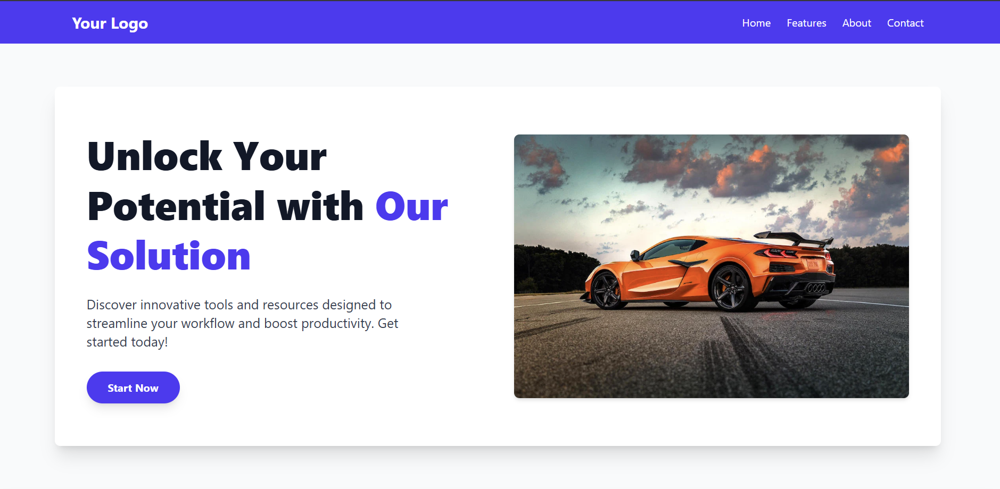
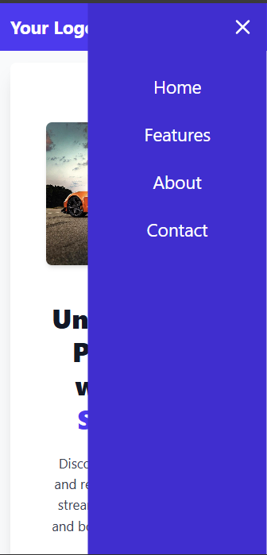

# A basic modern front end UI

This project is a React application built with Vite and styled using Tailwind CSS. It features a responsive design, including a dynamic navigation bar and an interactive accordion component and a slider.

---

## Features
- Responsive design for mobile and desktop

---

## Technologies Used
- **Frontend:**
    - React.js
    - Tailwind CSS

---

## Setup and Installation

1.  **Clone the repository:**
    ```bash
    git clone [https://github.com/dibesh7381/Responsive-Layout.git](https://github.com/dibesh7381/Responsive-Layout.git)
    cd first
    ```
2.  **Install dependencies:**
    ```bash
    npm install
    ```
3.  **Run the development server:**
    ```bash
    npm run dev
    ```
    The application will be available at `http://localhost:5173`.

---

## Demo Pictures

### Look in Desktop



### Look in Mobile


### Look with Menu bar



---

